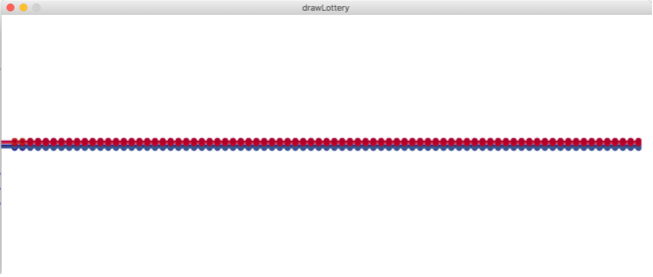
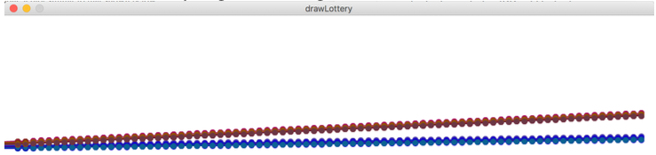
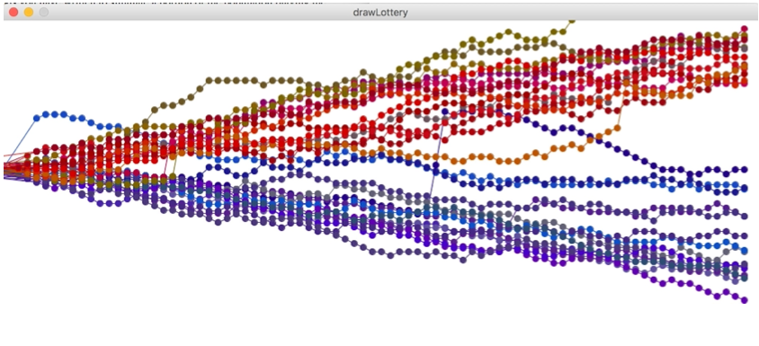

# Lab 4, CPE/CSC 203 – Interacting classes

## Orientation

For this lab you will implement a program that simulates a community of people playing the lottery over a period of time. It plots out their (pocket) cash over 80 years of behavior given a rough model of the lottery.

Some background: Lotteries were introduced by states as a way to raise money for education. Although, they seem like a good idea, in many ways, they can be very unfair.[^1] We will explore and demonstrate that the Georgia model for lottery winnings unfairly redistributes money from lower income community member to wealthier community members. For the purpose of this assignment, people are designated as `WELL_PAID` or `POORLY_PAID`, although income inequities are a complex and important topic, we are using a simple labeling and focus on the computation necessary to simulate lottery playing and show whether the lottery acts as a regressive tax.[^2]

## Objectives

* Understand the provided base code which represents a group of community members who are in turn represented in the code as “players”, which come from one of two groups, `WELL_PAID` or `POORLY_PAID`. The code plots out data related to each player’s (pocket) money in Processing over a period of 80 years. Each point in the plot is one year’s money starting at a baseline around $100. 
* Write code to simulate some members of the community playing the lottery, including **implementing various classes that interact with one another**. We will build on this in the future to introduce interfaces, but for now,
  follow the instructions and code structure to practice writing code related to interacting classes.
* Write code that operates on a collection of data in order to compute very simple statistics about that data

## Given Files

Obtain the given files from the following GitHub link: **_TODO_**

The given files include base code to help in plotting out the data for each member of the community, specifically a model of their (pocket) money over time. You will add to this code to simulate the impact of playing the lottery on this (pocket) money.

## Task

You must add to the base code to simulate the playing of the lottery. To start, run the code to make sure you can generate a plot similar to that shown below.



This plot is fairly boring as nothing happens each year. However, take the time to make sure you understand what it is happening in the code thus far. Note that the community is divided into two kinds of players designated by CMemberKind, which are `WELL_PAID` and `POORLY_PAID`. These two populations start with a small difference in pocket money, namely, well paid members of the population start with 100.1 - 101, while those who are poorly paid start with 99.0- 99.9 dollars. The plot of these two populations’ funds are drawn either as more reddish for WELL_PAID or more blue colored for those who are POORLY_PAID. Be sure to read CommunityLSim.java to see where this difference in the kind of people/players in the community are represented.

You will need to add several elements to simulate playing the lottery. I suggest you work through the following steps.

**_TODO_**
Fill in the method in `CommunityLSim.java` called `addPocketChange`. This method is meant to be executed every year (and there is already code in the `simulateYears` method which calls `addPocketChange`, so you just need to fill it in first to see a difference). For each player, if the kind of player is `WELL_PAID`, add 0.1f each year and for `POORLY_PAID` add 0.03f.

<small>Note: you will actually have to type the letter ‘f’ after the number as written above to have the number be recognized as a float instead of a double.</small>

Test to make sure you get something like this:



Next start by writing several methods to simulate the lottery.

**TODO** First edit the `CommunityMember` class to add necessary behaviour to player the lottery. Write a method `playRandom()` that generates 1 and 42 (inclusive). These will be the players “lotto numbers”. Be sure each number is unique (i.e. there are no repeats). You do get freedom to decide how to store and represent those five numbers, but I recommend looking into `HashSet` in the javadocs as an option. Also, look up `Random` in javadocs to see how to generate random numbers in a range. There are some math tricks to manipulate the range to be between the numbers you want using the functions available to you.

I have left the specifics of this method (parameters, return type, etc.) intentionally vague. This is for you to design.

**TODO**
Next, create a `Game.java` class that will represent any data necessary to play the lottery. This class should include behaviour to generate the winning lottery numbers, and data to store those numbers. Write a method called `winningLotNumber()` that generates and stores 5 unique random numbers between 1 and 42. Again, be sure each number is unique (i.e. there are no repeats).

**TODO**
Write a method in `Game.java` to compute how many numbers “match” (are the same) between two sets of numbers (i.e. the player's numbers and the lottery game). This method should return an integer value that represents how many numbers are the same in the two sets (regardless of order). Test this method with two sets of numbers for which you know the number of matches and make sure it works as expected.

**TODO**
Next write a method in `Game.java` to compute the monetary result of playing. Using the number of matches between a player’s selected numbers and the winning lottery numbers, compute the value of that turn’s winnings (which could be negative). It always costs one dollar to play the lottery, so start with the “winnings” being `-1`, however if the player[^3]:

* matches 2 numbers (to the winning lottery number) the “winnings” is one dollar, **$1**
* matches 3 numbers (to the winning lottery number) the “winnings” is **$10.86**
* matches 4 numbers (to the winning lottery number) the “winnings” is **$197.53**
* matches 5 numbers (to the winning lottery number) the “winnings” is **$212534.83**

**TODO**
To prepare for writing the code to simulate a portion of the community playing the lottery, fill in the helper method in `CommunityLSim.java` called `reDoWhoPlays()`, which also relies on another method you must write called `randomUniqIndx()`. The purpose of these methods is to simulate who in the community will play the lottery each year. The list of who will play the lottery should be drawn from the list of community members. Recall that the list of potential players is divided into two kinds of community members, with those who are `POORLY_PAID` (PP) in the first half of the list (i.e. indices 0-14 for a community of 30) and those who are `WELL_PAID` (WP) in the second half of the list (i.e. indices of 15-29 for a community of 30 people). For any population, we will simulate that 60% of those who are `POORLY_PAID` will play the lottery, while 40% of those who are `WELL_PAID` will play the lottery---this is a very rough model taken from information about gambling[^4]. You should end up with a list of **unique indices** (i.e., no one plays the lottery twice in one year) that is half the size of the entire population (convince yourself of this and think carefully about how to generate this list and test via printing it to make sure your indices are from the correct segment of the list of players). **For example, for a community of 30 players, 15 are PP, thus there should be 9 indices in the range 0-14, and 6 indices in the range 15-29.**

Again, I have left the specifics of these method signatures up to you.

**TODO**
Now, fill in the method `simulateYears` method in `CommunityLSim.java` to use the prior methods you have written to simulate a portion of the population playing the lottery every year, given the following constraints. Note that you are free to add data or getters or setters to the existing classes if you need to get or set necessary data to make the simulation work.

* Every year a new random group of the community will play the lottery (following the rules spelled out above).
* For every player who plays, add any cost or earnings from them playing the lottery to their money.
* In addition, to simulate that lottery winnings are redistributed to the community, we will model the re-distribution of the winnings as a merit based scholarship (as is done in Georgia), which unfairly distributes the money more often to those who are `WELL_PAID`. Specifically, if the player lost the lottery, that 'income' to the lottery game should be redistributed to someone in the community (as a 'scholarship’), with a 70% chance of that person being `WELL_PAID` and 30% chance of that person being `POORLY_PAID`. (This is roughly based on the way Georgia’s scholarships are distributed because they are merit based and those who are WP are more likely to be able to attend schools that have more resources.) First determine from which population the recipient will be (using the above rule) and then randomly choose a recipient (with a random index value in the correct range) to receive those funds (i.e. a positive $1). 
* Make sure that every year after all simulations, you update each player’s `moneyOverTime` by adding their end of year money to the array. Again, add any data or helper methods you need to accomplish this simulation.

When you run your code it should look something like these examples (it will not be an exact match due to our use of random numbers):



**TODO**
Finally, each year compute the amount of the wealthiest person (in pocket money) and the amount of the least wealthy person (in pocket money) and print this out each year, something like (values will vary due to using random numbers):

```
After year 0:
The person with the most money has: 102.940636
The person with the least money has: 98.03151
After year 1:
The person with the most money has: 104.584656
The person with the least money has: 97.03151
....
After year 79:
The person with the most money has: 290.44998
The person with the least money has: 71.38735
```

## Submission

Demo the lab to the instructor in lab on the day of the deadline and be sure to push your code to GitHub.

[^1]: http://www.radicalmath.org/docs/Lottery_Allman.pdf
[^2]: https://www.investopedia.com/terms/r/regressivetax.asp
[^3]: https://www.lotterypost.com/game/41/prizes/2018/6/29
[^4]: http://www.buffalo.edu/news/releases/2014/01/001.html
